# IoT Predictive Maintenance System

A serverless anomaly-detection API that ingests sensor telemetry (temperature & vibration) and flags anomalous readings in real time using **Modified Z-Score** analysis. Built with Python, AWS Lambda, and SAM.


---

## Architecture

### System Overview

```mermaid
flowchart TB
    subgraph IoT["IoT Sensors (Factory Floor)"]
        S1["Pump Sensor\n🌡 Temperature"]
        S2["Motor Sensor\n📳 Vibration"]
        S3["Compressor Sensor\n🌡 + 📳"]
    end

    subgraph AWS["AWS Cloud"]
        APIGW["API Gateway\nPOST /analyse\n(throttling + burst queue)"]

        subgraph Lambda["AWS Lambda (ARM64 · Python 3.12)"]
            HANDLER["lambda_handler\n(validation + routing)"]
            DETECTOR["AnomalyDetector\n(Modified Z-Score / MAD)"]
        end
    end

    RESP["JSON Response\n• anomaly scores\n• flagged metrics\n• per-sensor results"]

    S1 & S2 & S3 -->|"JSON payload\n(batch of readings)"| APIGW
    APIGW -->|"proxy event"| HANDLER
    HANDLER -->|"validated readings"| DETECTOR
    DETECTOR -->|"scored results"| HANDLER
    HANDLER -->|"200 OK"| RESP

    style IoT fill:#e8f5e9,stroke:#2e7d32,color:#000
    style AWS fill:#e3f2fd,stroke:#1565c0,color:#000
    style Lambda fill:#fff3e0,stroke:#e65100,color:#000
    style RESP fill:#f3e5f5,stroke:#6a1b9a,color:#000
```



### Request Lifecycle


### Burst Traffic Handling


**Why serverless?** Industrial IoT workloads are inherently bursty — a factory floor may push thousands of readings per second during a shift and almost zero overnight. Lambda scales from 0 to thousands of concurrent executions automatically, so you pay only for the compute you use and never have to pre-provision capacity for peak load. API Gateway absorbs traffic spikes with built-in throttling and queuing, preventing a burst of sensor data from overwhelming the detection service.

---

## How the Algorithm Works

### Modified Z-Score (MAD-based)

The classic Z-Score measures how many standard deviations a point is from the mean. The problem is that both the mean and the standard deviation are themselves distorted by the outliers you're trying to detect — a single extreme reading pulls the mean toward it and inflates sigma, masking the anomaly.

The **Modified Z-Score** replaces:

| Classic | Modified |
|---------|----------|
| Mean (μ) | **Median** |
| Std Dev (σ) | **Median Absolute Deviation (MAD)** |

**MAD** is the median of the absolute deviations from the median:

```
MAD = median( |xi − median(X)| )
```

The Modified Z-Score for each point is then:

```
Mi = 0.6745 × (xi − median(X)) / MAD
```

The constant **0.6745** is the 75th percentile of the standard normal distribution. It makes MAD a *consistent estimator* for σ when the underlying data is normally distributed, so the resulting score is directly comparable to a traditional Z-Score.

A reading is flagged as anomalous when its Modified Z-Score exceeds a configurable threshold (default **3.5**, a widely-used conservative value from Iglewicz & Hoaglin, 1993).

**Why this matters for sensor data:** A single overheating motor shouldn't shift the baseline for every other sensor in the batch. The median-based approach ensures that a handful of extreme readings don't mask each other.

### Detection Flow

```mermaid
flowchart TD
    INPUT["Input: batch of sensor readings\n[temperature[], vibration[]]"]
    MEDIAN["Compute median for each metric"]
    DEV["Compute absolute deviations\n|xi − median(X)|"]
    MAD["Compute MAD\nmedian of absolute deviations"]

    MAD_CHECK{MAD = 0?}
    FALLBACK["Fallback: use mean-based\nstandard Z-Score"]
    ZSCORE["Modified Z-Score\n0.6745 × (xi − median) / MAD"]

    THRESH{"Score > threshold\n(default 3.5)?"}
    NORMAL["Label: Normal"]
    ANOMALY["Label: ANOMALY\nflag anomalous metrics"]

    OUTPUT["Output: per-reading result\n• is_anomaly\n• anomaly_scores\n• anomalous_metrics"]

    INPUT --> MEDIAN --> DEV --> MAD --> MAD_CHECK
    MAD_CHECK -- Yes --> FALLBACK --> THRESH
    MAD_CHECK -- No --> ZSCORE --> THRESH
    THRESH -- No --> NORMAL --> OUTPUT
    THRESH -- Yes --> ANOMALY --> OUTPUT

    style INPUT fill:#e3f2fd,stroke:#1565c0,color:#000
    style ANOMALY fill:#ffebee,stroke:#c62828,color:#000
    style NORMAL fill:#e8f5e9,stroke:#2e7d32,color:#000
    style OUTPUT fill:#f3e5f5,stroke:#6a1b9a,color:#000
```



---

## Project Structure


```
.
├── src/
│   ├── __init__.py
│   ├── detector.py           # AnomalyDetector class (Modified Z-Score)
│   └── lambda_function.py    # AWS Lambda handler
├── tests/
│   ├── __init__.py
│   └── test_detector.py      # Unit + integration tests
├── .github/
│   └── workflows/
│       └── main.yml          # CI pipeline (pytest on push)
├── template.yaml             # AWS SAM infrastructure-as-code
├── requirements.txt
└── README.md
```

---

## Quick Start

### Prerequisites

- Python 3.11+
- [AWS SAM CLI](https://docs.aws.amazon.com/serverless-application-model/latest/developerguide/install-sam-cli.html) (for deployment)

### Install & Test Locally

```bash
python -m venv .venv && source .venv/bin/activate
pip install -r requirements.txt
pytest tests/ -v
```

### Invoke Locally with SAM

```bash
sam build
sam local invoke AnomalyDetectorFunction -e events/sample.json
```

### Deploy to AWS

```bash
sam build
sam deploy --guided
```

---

## API Usage

### `POST /analyse`

**Request:**

```json
{
  "readings": [
    {"sensor_id": "pump-01", "temperature": 71.2, "vibration": 0.52},
    {"sensor_id": "pump-02", "temperature": 70.8, "vibration": 0.49},
    {"sensor_id": "pump-03", "temperature": 198.5, "vibration": 4.10}
  ]
}
```

**Response:**

```json
{
  "total_readings": 3,
  "anomalies_detected": 1,
  "results": [
    {
      "sensor_id": "pump-01",
      "temperature": 71.2,
      "vibration": 0.52,
      "is_anomaly": false,
      "anomaly_scores": {"temperature": 0.1234, "vibration": 0.2345},
      "anomalous_metrics": []
    },
    {
      "sensor_id": "pump-03",
      "temperature": 198.5,
      "vibration": 4.10,
      "is_anomaly": true,
      "anomaly_scores": {"temperature": 8.912, "vibration": 7.654},
      "anomalous_metrics": ["temperature", "vibration"]
    }
  ]
}
```

---

## CI/CD


Every push to `main` triggers a GitHub Actions workflow that:

1. Sets up Python 3.11 and 3.12
2. Installs dependencies
3. Runs the full `pytest` suite

The pipeline ensures that any regression in anomaly detection logic is caught before code reaches production.

---

## Technologies

| Layer | Technology |
|-------|-----------|
| Language | Python 3.12 |
| Anomaly Detection | NumPy (Modified Z-Score / MAD) |
| Compute | AWS Lambda (ARM64, 256 MB) |
| API | Amazon API Gateway |
| IaC | AWS SAM |
| Testing | pytest |
| CI/CD | GitHub Actions |
